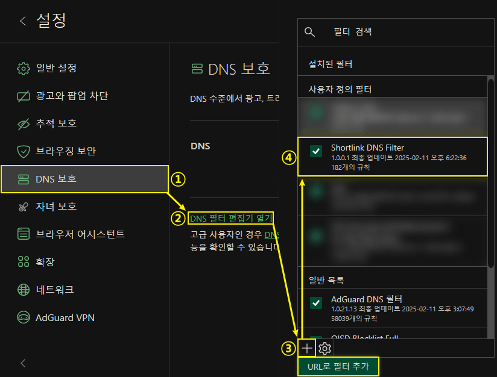
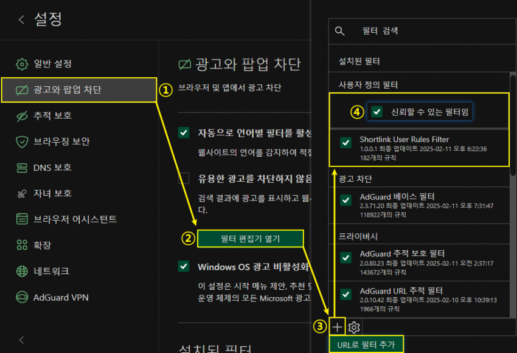

# 🛡️ Shortlink DNS Filter


대량의 숏링크 주소를 차단합니다 

---

### 사용 권장
- **AdGuard**
- **uBlock Origin**
- 기타 호환되는 광고 차단 도구

---

#### 🚫 DNS 차단 (DNS 필터, 접속 원천 차단)

```
https://cdn.jsdelivr.net/gh/Null772/Shortlink-DNS-Filter@latest/Shortlink_Filter.txt
```

---

#### 👆 사용자 규칙 차단 (일반 필터, 접속 선택 차단)

```
https://cdn.jsdelivr.net/gh/Null772/Shortlink-DNS-Filter@latest/Shortlink_Filter-User-Rules.txt
```